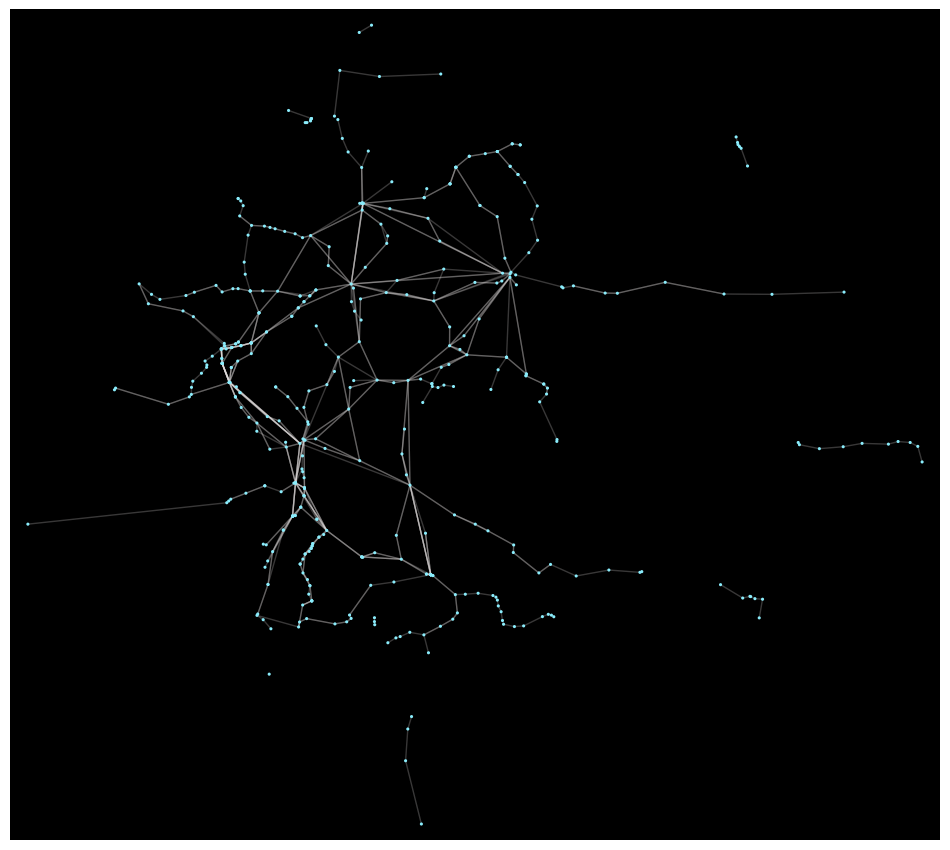
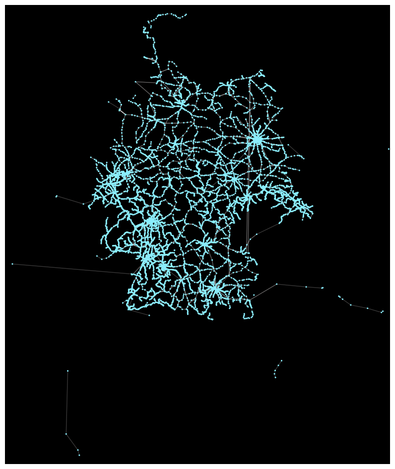

# `gtfstop` : Topological Analysis of GTFS data

## What is GTFS Data?
General Transit Feed Specification or 'GTFS' for short, is a common data format for public transportation schedules and associated geographic information. It was developed by Google in partnership with Portland TriMet and is used by transit agencies to share their schedule and route data with software developers, who can then incorporate this data into transit apps, trip planners, and other tools for the public.

GTFS data typically consists of a series of text files contained within a .zip file. Each text file corresponds to a different type of information, such as routes, stops, trips, schedules, and more. To see what files are used by this project and to view their content simply download and extract one of the zip files present in `data`. 

All the GTFS data files used in the package have been validated using a GTFS validator [https://gtfs-validator.mobilitydata.org/]. Many thanks to MobilityData for this!

To generate transit graphs from GTFS data the following steps were used - 
1. Firstly, download the relevant GTFS data, typically available in zip files. For this project, transit feeds from Germany have been used [taken from - https://gtfs.de/en/main/]
2. Follow the instructions provided in the file `regional.py` to generate the transit graph. For example, a graph of the routes covered by the ICE was plotted from the given feed.
3. Huge shoutout to Kuan for creating peartree [https://github.com/kuanb/peartree] that helps in converting GTFS feeds to networkX graphs using partridge objects!
4. For city-wise networks, the local transit data from the GTFS DE website [https://gtfs.de/en/feeds/de_nv/] is downloaded, unzipped and used. You can store the files extracted in the `data/Local_Transit` folder to use them as shown in `local.py`
5. The city networks generated have been stored in the `city_networks` subfolder present in `results`. For example purposes, the maps of the cities Aachen, Berlin, Frankfurt, Hamburg and Munich have been displayed.

An example graph generated for Long Distance Rail (ICE data) is - 

And the graph generated using regional data would look like - 

## Installation

The code has been tested with Python 3.10 under Windows but this should also work smoothly for Linux and macOS. Other Python versions *may* not support all dependencies.

The recommended way to install the project is via [`poetry`](https://python-poetry.org/).
If this is available, installation should work very quickly:

    $ poetry install

## Usage 
`gtfstop` is still a work in progress. You can try out the code (mentioned in 'Experiments') for your own projects!

## Experiments 
To reproduce the dataset creation process run the files `regional.py` for generating a Pytorch dataset object for long distance and regional data (ICEs, RBs etc.) and `local.py` for Local Transit Data (Buses, Trams, UBahns etc.). The dataset object created can be used in Pytorch Geometric as `Dataloader` which can be used for training graph neural networks and other downstream tasks.
Visualizations for persistent homology and Euler curves experiments can be found in the relevant folders as well. All other output will be written to `stdout` i.e. the standard output of your terminal, and
needs to be redirected to a file for subsequent analysis, if so desired.
Further tests/experiments related to connectivity, symmetry, node and features of the obtained transit graphs etc. can be found in the relevant Jupyter notebooks in the `experiments` folder.

## License 
TBA 

## Contributing and Issues

This project is maintained by Tejas of the [AIDOS Lab](https://github.com/aidos-lab).
Please open an [issue](https://github.com/aidos-lab/gtfstop/issues) in
case you encounter any problems or want to contribute.

### Updates required

1. Add support for more German cities
2. Add a descriptive example for usage of the package (dataset) 
